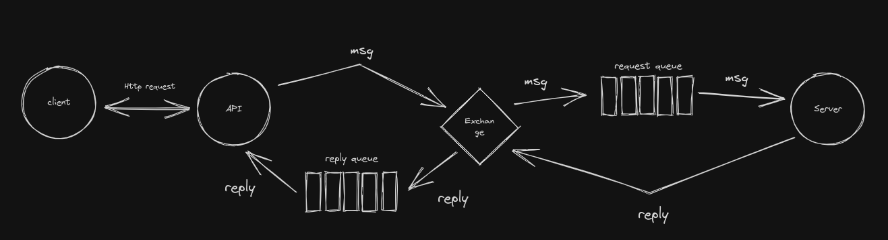

Det har været en stor hovedpine at finde ud af, hvordan et al logik og dataindhentning, som skal til for at svare på et request fra en client, kunne foregå indenfor et HTTP request. Årsagen var, at kommunikationen fra Gateway Service (som modtager HTTP request), til de services som skal levere data, foregår via RabbitMq. Jeg var ude i vilde ideer med, at gemme en liste i Gateway, som indeholdt samtlige repsonses, som services havde leveret tilbage til Gateway, for så at gennemgå den liste og matche et request fra en client med et response fra en service. Det kunne potentielt have fungeret, men det ville være meget komplekts og besværligt, for ikke at sige langsommeligt. Heldigvis findes der i RabbitMq et request-reply pattern, som kan anvendes til dette formål. 

### Request-Reply pattern (RPC)
I RPC sendes der fra en producer, et request til en kø som en consumer lytter på. I samme omgang opretter producer en eksklusiv svar-kø, som consumer sender sin response på. Producer lytter i samme omgang på en svar-kø, og modtager respons der, som så kan sendes tilbage til det oprindelige HTTP request. Det kan visualiseres således:

I vores system kunne det være:
1. Client = Single Page App
2. API = Gateway Service
3. Exchange = LeakTest Exchange
4. Request queue = get-all-requests
5. Reply queue = eklusiv svar-kø, autogeneret af rmq.

På den måde sikrer vi, at kommunikationen foregår indenfor et HTTP request, hvilket gør, at brugeren får sit svar med det samme. Den eksklusive svar-kø gør, at vi også er helt sikre på, at den repsons som vi sender tilbage til klienten, er præcis det respons vi gerne vil sende, og ikke et andet fra et andet request.