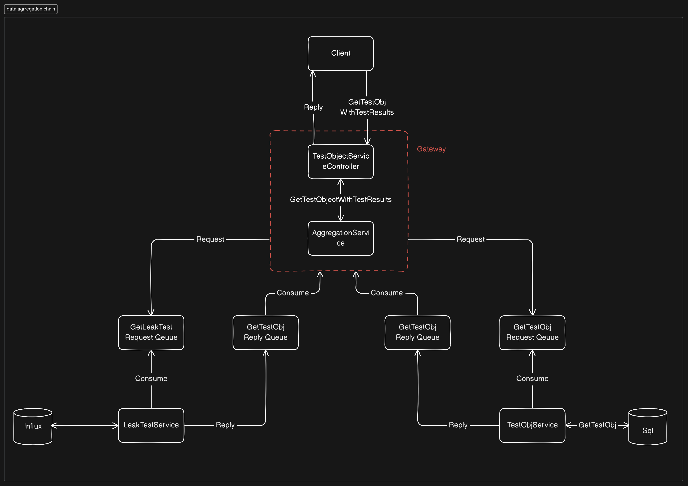

Når man opbygger en microservies arkitektur vil der ofte opstå situationer, hvor man har behov for, at samle data fra 
forskellige services, for at kunne returnerer en meningsfuld respons til clienten. Til det formål har jeg valgt, 
at implementere en data aggregerings service i mit gateway.

Diagrammet herunder visualiserer et HTTP request hvor der hentes et test objekt og tilhørende test resultater:



I ovenstående situation modtager gateway altså data fra to services. For at undgå, at gateway skal have en masse
kompleks logik til at håndtere data i forskellige formater, har jeg implementeret en ApiResponse klasse, som udgør
skabelonen for hvordan et response skal se ud:

```c#
public class ApiResponse<T>
{
    public int StatusCode { get; set; }
    public T? Data { get; set; }
    public string? ErrorMessage { get; set; }
}
```

Denne klasse implmenterer jeg i GatewayService, LeakTestService og TestObjectService. Når en service skal returner
data til Gateway, mappes det således til et ApiResponse, hvor der gives en statuskode, som gør det enkelt at håndterer
forskellige scenarier i Gateway. Hvis det er en 200 OK, så kan Gateway fortsætte med "happy path", hvis ikke, så kan
den reagere hensigtmæssigt baseret på statuskoden. Det gør, at jeg ikke behøver implementere en logik som læser 
specifikke fejlmeddelelser, eller konstruere forgreninger med komplekse betingelser. Data propertien indeholder den
efterspurgte ressource, uanset om det er et testobjekt eller et testresultat. Slutteligt indeholder responsen en 
fejlmeddelelse hvis der skulle være nogen. Det er f.eks. implementeret således i en af mine services:

```c#
try
  {
      var leakTests = await leakTestHandler.GetWithinTimeRangeAsync(start, end);
      return CreateApiResponse(200, leakTests, null);
  }
catch (ValidationException e)
  {
      Console.WriteLine($"Validation failed: {e.Message}");
      return CreateApiResponse(400, null, e.Message);
  }
catch (Exception e)
  {
      Console.WriteLine($"An error occurred: {e.Message}");
      return CreateApiResponse(500, null, e.Message);
  }
```
hvor CreateApiResponse ser sådan ud:
```c#
private static string CreateApiResponse(int statusCode, List<LeakTest> data, string errorMessage)
{
    var apiResponse = new ApiResponse<List<LeakTest>>
    {
        StatusCode = statusCode,
        Data = data,
        ErrorMessage = errorMessage
    };

    return JsonSerializer.Serialize(apiResponse, new JsonSerializerOptions { WriteIndented = true });
}
```
Der oprettes altså et nyt `ApiResponse<T>` objekt som serialiseres til et JsonObject, der kan returneres til Gateway
via RabbitMQ. Det samme er implementeret i TestObjectService, og den måde, kan GatewayService modtage data fra 
de andre services, i et standardiseret format. 

I Gateway har jeg lavet en aggregeringsDTO:

```c#
public class TestObjectWithResultsDto
{
    public TestObjectDto? TestObjectDto { get; set; }
    public List<LeakTestDto?> LeakTestDto { get; set; }
}
```
som jeg benytter som input i et nyt ApiResponse objekt:
```c#
private ApiResponse<TestObjectWithResultsDto> CreateTestObjectWithResultsDto(
        ApiResponse<List<LeakTestDto>>? leakTestApiResponse, ApiResponse<TestObjectDto>? testObjectApiResponse)
    {
        try
        {
            Console.WriteLine("Trying to create api response.");
            if (leakTestApiResponse.StatusCode != 200 && testObjectApiResponse.StatusCode != 200)
            {
                var combinedErrorMessage = new StringBuilder();
                combinedErrorMessage = combinedErrorMessage.Append(testObjectApiResponse.ErrorMessage)
                    .Append(leakTestApiResponse.ErrorMessage);
                Console.WriteLine($"None of the services return 200 OK. TestObjectService returned: {testObjectApiResponse.StatusCode} with message: {testObjectApiResponse.ErrorMessage}. " +
                                  $"LeakTestService returned: {leakTestApiResponse.StatusCode} with message: {leakTestApiResponse.ErrorMessage}.");
                throw new DataAggregationFailedException($"Could not fetch message due to the follow error(s): " +
                                                         $"{combinedErrorMessage}");
            }

            if (leakTestApiResponse.StatusCode != 200 && testObjectApiResponse.StatusCode == 200)
            {
                Console.WriteLine("No test results matched the provided id. Creating partial response.");

                var testObjectWithResultsDto = new TestObjectWithResultsDto()
                    { TestObjectDto = testObjectApiResponse.Data };
                return new ApiResponse<TestObjectWithResultsDto>()
                {
                    StatusCode = 206,
                    Data = testObjectWithResultsDto,
                    ErrorMessage =
                        $"No test data matched the provided test object id {testObjectApiResponse.Data.Id}. " +
                        $"Only the requested test object could be returned. {leakTestApiResponse.ErrorMessage}"
                };
            }

            if (leakTestApiResponse.StatusCode == 200 && testObjectApiResponse.StatusCode != 200)
            {
                Console.WriteLine("No test object matched the provided id. Creating partial response.");

                // Create partial response message. 
                var testObjectWithResultsDto = new TestObjectWithResultsDto
                    { LeakTestDto = leakTestApiResponse.Data };
                return new ApiResponse<TestObjectWithResultsDto>
                {
                    StatusCode = 206,
                    Data = testObjectWithResultsDto,
                    ErrorMessage =
                        $"No test object matched the provided test object id {leakTestApiResponse.Data.SingleOrDefault().LeakTestId}. " +
                        $"Only the requested test data could be returned. {testObjectApiResponse.ErrorMessage}"
                };
            }
            else
            {
                var testObjectWithResultsDto = new TestObjectWithResultsDto
                {
                    TestObjectDto = testObjectApiResponse.Data, 
                    LeakTestDto = leakTestApiResponse.Data
                };

                return new ApiResponse<TestObjectWithResultsDto>() { Data = testObjectWithResultsDto ,StatusCode = 200};
            }
        }
        catch (DataAggregationFailedException e)
        {
            throw;
        }
        catch (Exception e)
        {
            Console.WriteLine(e);
            throw;
        }
    }
```

Det er en stor metode, men den er afgørende for produceringen af meningsfulde svar til klienten. Hvis ingen services
leverer 200 OK returneres en passende meddelelse, der fortæller klienten hvad årsagen var. I tilfælde
hvor der både LeakTestService og TestObjectService producerer 200 OK er det lige til. Så samles data til et 
`ApiResponse<TestObjectWithResultsDto>` objekt, der returneres til brugren. Hvis kun den ene service leverer
en 200 OK returneres en 206 Partial Response, med data fra den service der kunne levere. 

Nedenfor vises eksempler på først en succesfuld respons og dernæst en partial:
```json
{
    "StatusCode": 200,
    "Data": {
        "TestObject": {
            "Id": "68acad77-b78b-4fc2-8c2c-468f739981a5",
            "Type": "TestObject1",
            "SerialNr": "SN123456",
            "ImagePath": "path/to/your/image.jpg",
            "SniffingPoints": [
                {
                    "Id": "60e67b22-fd2d-43db-8bc6-312532624b73",
                    "Name": "Point1",
                    "X": 23.5,
                    "Y": 47.8,
                    "TestObjectId": "68acad77-b78b-4fc2-8c2c-468f739981a5"
                },
                ...(more sniffing points here)
            ]
        },
        "LeakTests": [
            {
                "timeStamp": "2023-10-23T08:15:23.123Z",
                "testObjectId": "068acad77-b78b-4fc2-8c2c-468f739981a5",
                "status": "OK",
                "machineId": "db166ffd-8763-4825-be8d-e3ee72815751",
                "testObjectType": "type1",
                "user": "user1",
                "sniffingPoint": "60e67b22-fd2d-43db-8bc6-312532624b73",
                "reason": null,
                "leakTestId": "12e19bfa-5713-4572-92af-d8a522f66664",
                "measurement": "LeakTest",
                "links": {
                    "self": "http://localhost:5001/api/LeakTests/12e19bfa-5713-4572-92af-d8a522f66664"
                }
            },
          ...(more leak tests here)
        ]
    },
    "ErrorMessage": null
}
```
```json
{
  "statusCode": 206,
  "data": {
    "testObjectDto": {
      "id": "01bf235d-c5e3-4d8b-a88a-f1e2c06374b1",
      "type": "TestObject1",
      "serialNr": "SN123456",
      "imagePath": "path/to/your/image.jpg",
      "sniffingPoints": [
        {
          "id": "3ec94157-469e-4be5-b81b-657f16539c42",
          "name": "Point1",
          "x": 23.5,
          "y": 47.8,
          "testObjectId": "01bf235d-c5e3-4d8b-a88a-f1e2c06374b1"
        },
        {
          "id": "245a0ac2-3d53-4365-bd21-ed99401e6ae4",
          "name": "Point2",
          "x": 12.3,
          "y": 34.6,
          "testObjectId": "01bf235d-c5e3-4d8b-a88a-f1e2c06374b1"
        }
      ],
      "links": null
    },
    "leakTestDto": null
  },
  "errorMessage": "No test data matched the provided test object id 01bf235d-c5e3-4d8b-a88a-f1e2c06374b1. Only the requested test object could be returned. No test results match the specified tag key-value pair."
}
```
hvor der altså ikke kunne returneres leak testdata, da der ikke findes noget test data om det specifikke testobjekt.

På den måde kan man konsekvent returnere meningsfulde svar til klienten, i et format der er nemt at arbejde videre med
uanset hvilken client der kalder. Det er vigtigt når man opbygger et headless microservices system.
