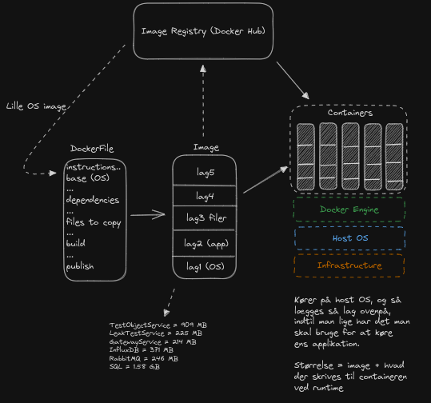

Først vil jeg lige give et overblik over flowet fra Dockerfile til kørende container:



Hvor det ses, at man starter med en Dockerfile som indeholder nogle instruktioner der er stablet i lag, hvilket bliver til det Image som i 
sidste ende implementeres i containers. For at køre en container har man brug for en infrastruktur (fysik hardware),
et Linuxbaseret OS eller Windows med Windows Subsystem for Linux (WSL) og Docker Engine installeret. Når man har det,
kan man køre lige så mange containers som ens hardware og netværksforbindelse tillader. 


## Dockerfile
Vi starter med et hurtigt overblik over `Dockerfile`, som er den konfigurationsfil der danner grundlaget
for det `Docker Image` som senere implementeres i `containers`.

En `Dockerfile` er en tesktfil som Docker læser for at bygge et Image. Den indeholder alle kommandoer, i rækkefølge,
som er nødvendige for at bygge et givent image. Filen opbygges af read-only lag, som hver især repræsenterer en instruktion.

Herunder ses Dockerfilen for TestObjectService:
```dockerfile
# Use the .NET runtime as the base image
FROM mcr.microsoft.com/dotnet/runtime:7.0 AS base
WORKDIR /app

# Use the .NET SDK image to build the application
FROM mcr.microsoft.com/dotnet/sdk:7.0 AS build

WORKDIR /src
COPY ["TestObjectService/TestObjectService.csproj", "TestObjectService/"]
RUN dotnet restore "TestObjectService/TestObjectService.csproj"
COPY . .
WORKDIR "/src/TestObjectService"
RUN dotnet build "TestObjectService.csproj" -c Release -o /app/build

# Publish the application
FROM build AS publish
RUN dotnet publish "TestObjectService.csproj" -c Release -o /app/publish /p:UseAppHost=true

# Final stage/image
FROM mcr.microsoft.com/dotnet/sdk:7.0 AS final

WORKDIR /app
COPY --from=publish /app/publish .

# Ensure the tool path is in the environment for runtime
ENV PATH="$PATH:/root/.dotnet/tools"

# Set the command to run your application
CMD ["dotnet", "TestObjectService.dll"]
```

Når billedet er færdigt kan man upload det til et image registry, såsom Docker Hub, hvorfra man senere kan pull det, 
f.eks. fra en anden maksine. 

## Image
Et `Docker Image` er en fil som anvendes til at eksekverer kode i en `Docker Container`. Det er et sæt af instruktioner
til at bygge en container og fungerer altså som en skabelon. Som nævnt består et image af lag der er stablet, hvilket 
kan visualiseres med kommandoen `docker image history <image name>`:


```
olav@olav-desktop:~$ docker image history olavlinddam/leakmonitor:testobjectservice
IMAGE          CREATED       CREATED BY                                      SIZE      COMMENT
821189af83cb   4 days ago    CMD ["dotnet" "TestObjectService.dll"]          0B        buildkit.dockerfile.v0
<missing>      4 days ago    ENV PATH=/usr/local/sbin:/usr/local/bin:/usr…   0B        buildkit.dockerfile.v0
<missing>      4 days ago    COPY /app/publish . # buildkit                  87.6MB    buildkit.dockerfile.v0
<missing>      10 days ago   WORKDIR /app                                    0B        buildkit.dockerfile.v0
<missing>      2 weeks ago   RUN /bin/sh -c powershell_version=7.3.7     …   41.8MB    buildkit.dockerfile.v0
<missing>      2 weeks ago   RUN /bin/sh -c curl -fSL --output dotnet.tar…   492MB     buildkit.dockerfile.v0
<missing>      2 weeks ago   RUN /bin/sh -c apt-get update     && apt-get…   74.8MB    buildkit.dockerfile.v0
<missing>      2 weeks ago   ENV ASPNETCORE_URLS= DOTNET_GENERATE_ASPNET_…   0B        buildkit.dockerfile.v0
<missing>      2 weeks ago   COPY /shared/Microsoft.AspNetCore.App /usr/s…   21.8MB    buildkit.dockerfile.v0
<missing>      2 weeks ago   ENV ASPNET_VERSION=7.0.13                       0B        buildkit.dockerfile.v0
<missing>      2 weeks ago   RUN /bin/sh -c ln -s /usr/share/dotnet/dotne…   24B       buildkit.dockerfile.v0
<missing>      2 weeks ago   COPY /dotnet /usr/share/dotnet # buildkit       73.2MB    buildkit.dockerfile.v0
<missing>      2 weeks ago   ENV DOTNET_VERSION=7.0.13                       0B        buildkit.dockerfile.v0
<missing>      2 weeks ago   RUN /bin/sh -c apt-get update     && apt-get…   36.2MB    buildkit.dockerfile.v0
<missing>      2 weeks ago   ENV ASPNETCORE_URLS=http://+:80 DOTNET_RUNNI…   0B        buildkit.dockerfile.v0
<missing>      2 weeks ago   /bin/sh -c #(nop)  CMD ["bash"]                 0B        
<missing>      2 weeks ago   /bin/sh -c #(nop) ADD file:5fb15e28ab9cd52a4…   80.6MB 
```

I disse lag ligger alt hvad der skal til for at eksekvere koden, herunder libraries, tools, dependencies samt koden.
Denne lagdelte struktur holder billederne meget små. Det er bl.a. fordi, at Docker arver delte lag, hvilket vil sige,
at når jeg anvender .NET SDK som et lag, så bliver hele .NET SDK ikke installeret, men i stedet ligger der en reference
til et andet Docker Image af .NET SDK. Det betyder, at hvert lag repræsenterer kun forskellen fra de foregående lag, og 
når de første lag, i mit tilfælde .NET Runtime og .NET SDK, indeholder alt der skal til for at køre en ASP.NET applikation,
bliver de resterende lag blot kommandoer og små filer der skal kopieres med over. 

## Containers
Når man har sit Docker Image på plads, kan man anvende det til at skabe lige så mange containers man har lyst til, baseret
på det image. Hver container er en eksekvering af det image og størrelsen af containeren bliver således også kun størrelsen
af ens image, i hvert fald til at starte med. Som nævnt er images read-only, men når man starter en container, bygges der
et read-write lag ovenpå. Alt der skrives til containeren øger containerens størrelse, hvis det er en stateful applikation
der kørers i containeren. Når en container slettes (ikke stoppes, men slettes helt), mister man således alt der er skrevet
til containeren, med mindre man anvender `Docker Volumes` til at persistere data. En container kan bindes til et volume,
hvormed man f.eks. kan gemme al data der skrives til en container som kører en SQL server. På den måde kan andre containers
også tilgå den data. 
