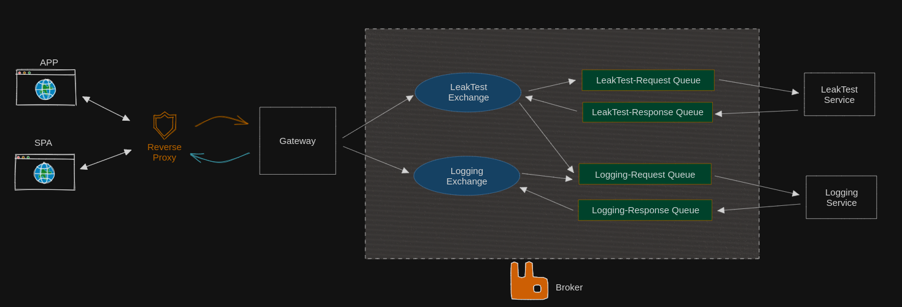

Efter at have gjort nogle flere tanker omkring arkitekturen er jeg kommet frem til denne model:

Hvor klienterne kommunikerer med et API gateway via en firewall/proxy. Gateway er ansvarlig for at fordele beskeder ud til 
de rigtige queues, som håndteres af en RabbitMQ instans. Hver service er tilknyttet to eller flere queues, til at håndtere
indgående og udgående trafik. I skemaet er der to queues pr. service, men LeakTestService kan producerer beskeder til 
LoggingService's request queue. 
Dette er selvfølgelig et forsimplet eksempel, og systemet vil i sidste ende være en del større, end det som er afbildet her.
